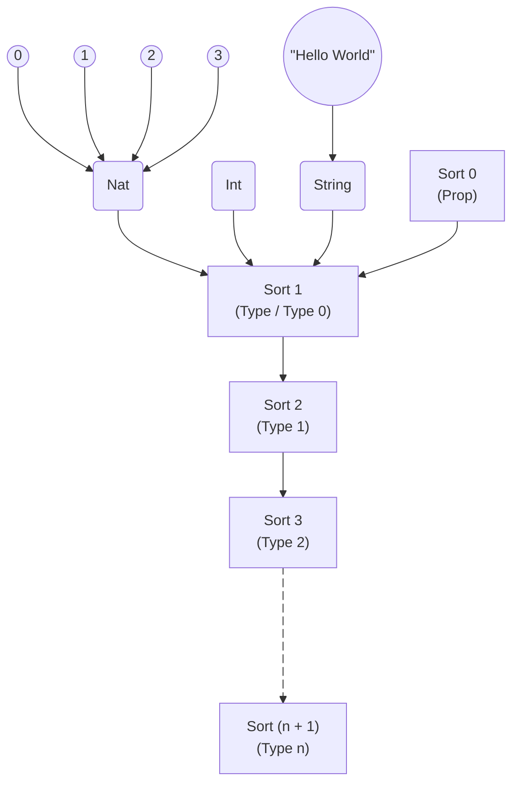

# Implict Implications

Pop-quiz! What happens when I write:

```lean
#check 4
```

You know this one! The Lean infoview returns:

~~~admonish example title=""
```lean
#check Nat
```
4 : Nat
~~~

Because \\(4\\) is a member of type `Nat`.

But what might you expect if I write?

```lean
#check Nat
```

Will Lean throw a compilation error? Will it return something? Let's see:

~~~admonish example title=""
```lean
#check Nat
```
Nat : Type
~~~

That's a bit of a head-scratcher isn't it. The type `Nat`, seems to be an 
expression with type `Type`.

Well let's go one step further:

~~~admonish example title=""
```lean
#check Type
```
Type : Type 1
~~~

Uh...

~~~admonish example title=""
```lean
#check Type 1
```
Type 1 : Type 2
~~~

Hold on...


~~~admonish example title=""
```lean
#check Type 2
```
Type 2 : Type 3
~~~

What is going on here?

What you are seeing is one of the most powerful aspects of Lean known as
_dependent type theory_. A type is itself an expression; 
and every expression must itself have a type!

Take a moment to digest this, because
it _really_ is turtles all the way down. 
You'll never run out of type _universes_. `Nat` is a member of `Type`, 
which is a member of `Type 1`, which is a member of `Type 2`, 
and so on, forever...

~~~admonish example title=""
```lean
#check Type 9999
```
Type 9999 : Type 10000
~~~

In this tutorial, almost all types you'll encounter 
(including `Nat`, `Int`, `String`, etc.) will be members of the `Type` 
universe, which contains all regular types.

But for now, understand that `Nat` and `String` are themselves expression with
type `Type`. So you could for example write a function which treats them
as expressions like so:

```lean
def stringOrNat (b : Bool) : Type := if b then String else Nat
```

But were using Types as expressions really shines is in writing functions over
_generic types_.

## The `id` function

One of the most fundamental functions in functional programming is `id`. `id` 
may seem useless at first, but you'll come to see it is very powerful.

`id` is a simple function, it takes an input, and returns the output.

Let's walk through making our own `id`. First let's try to build one with what
we have so far!

If we wanted an `id` function for `Nat` we might write:

~~~admonish example title=""
```lean
def idNat (n : Nat) : Nat := n
```
~~~

Then calling `#eval idNat 3` would produce `3`, `#eval idNat 4` would produce
`4`, and so on.

If we wanted to write an `id` function for Strings, we might write:

~~~admonish example title=""
```lean
def idString (s : String) : String := s
```
~~~

And an `id` function for `Bool` ...

~~~admonish example title=""
```lean
def idBool (b : Bool) := b
```
~~~

It suddenly becomes an exhausting job, for a very simple function that takes
a value and returns that value, do we really have to write a function for each
type?

In other programming languages, we have the concepts of generics, or templates,
or duck typing. What tool does Lean provide?

Remember a type is itself _an expression_. So we could just pass a type as an
argument!

~~~admonish example title=""
```lean
def idType (α : Type) (x : α) : α := x
```
~~~

This is a very interesting expression! We take an argument `α`, which is of type
`Type`, and we take an argument `x` which is of type `α`!

And suddenly, we've made an `idType`, which will work for any type in `Type`!

~~~admonish example title=""
```lean
#eval idType Bool true
```
true
~~~

~~~admonish example title=""
```lean
#eval idType String "Hello World"
```
"Hello World"
~~~

~~~admonish example title=""
```lean
#eval idType Nat 3
```
3
~~~

That's pretty exciting! But `idType` is not necessarily the most 
ergernomic of functions. Writing out an explicit type parameter is pretty
inconvenient, and if working with a deep chain of functions, having to pass
down the type parameter is fairly inconvenient.

As we know by now Lean is good at guessing types. Can't Lean just guess `α`?
And the answer is: Yes! 

In Lean you can use something call the hole term  `_` in place of an
argument. This tells Lean to guess what value an argument should have
(literally: fill this hole with what you think!) 
If arguments are dependent on each other (like how `x` is dependent on `α`), 
Lean's type resolver can often guess what `α` should be based on `x` alone!

~~~admonish example title=""
```lean
#eval idType _ 3
```
3
~~~

~~~admonish example title=""
```lean
#eval idType _ "Hello World"
```
"Hello World"
~~~

~~~admonish example title=""
```lean
#eval idType _ false
```
false
~~~

## Curly brace arguments

Our `idType` function is okay, but it could be much better.
Having to type a wildcard (`_`) every time is inconvenient when calling `idType`.
Ideally it would be great if we could write `idType` in such a way that we could
say "this parameter is implied, the caller shouldn't have to ever provide it."

Lean thinks so too! We can make `α` implied by changing our
parentheses to curly braces, like so:

~~~admonish example title=""
```lean
def idType' {α : Type} (x : α) : α := x
```
~~~

Now we can call `idType'` like so:

~~~admonish example title=""
```lean
#eval idType' false
```
false
~~~

~~~admonish example title=""
```lean
#eval idType' 42
```
42
~~~

Sometimes, the caller _does_ need to provide an implicit parameter.
If we ever encounter such a scenario, Lean does provide a mechanism that allows
the user to provide the curly-brace parameters explicitly by adding the 
`@` symbol before the function name.

~~~admonish example title=""
```lean
#eval @idType' Int 42
```
42
~~~


## Type universes

Wow! That's pretty powerful. We've written a generic function that will work
for any type!

Well..._almost_ any type, let's consider our type signature once again:

~~~admonish example title=""
```lean
#check idType' 42
```
idType' {α : Type} (x : α) : α
~~~

We've actually artificially restricted ourselves here. Look at `α` closely, 
`α` must be a member of `Type`.  So it's going to fail say, 
for members of `Type 3`!

~~~admonish bug title="Bad Type"
```lean
#check idType' (Type 2)
```
Application type mismatch: The argument  
&nbsp;&nbsp;Type 2  
has type  
&nbsp;&nbsp;Type 3  
of sort `Type 4` but is expected to have type  
&nbsp;&nbsp;?m.2  
of sort `Type` in the application  
&nbsp;&nbsp;idType' (Type 2)
~~~

This is unfortunate. We wanted our `id` function to be _truly_ generic over 
anything. How do we make it accept expressions of _any_ universe?

### Sorts

Previously, I mentioned Lean relies on dependent type theory, which gives
us this hierarchy of types, sometimes known as universes or _sorts_.
Every universe has a _level_ which is a natural
number.

In Lean, the universe level `u` in `Type u` is an alias of `Sort u + 1`.

| Sort | Type | Alias|
|------|------|------|
| `Sort 0` | n/a | `Prop` |
| `Sort 1` | `Type 0` | `Type` |
| `Sort 2` | `Type 1` | |
| `Sort 3` | `Type 2` | |
| ... | ... |... | ... |
| `Sort (n+1)` | `Type n` | |

`Sort 0` is a very special universe which I won't cover here. `Sort 0` holds 
"propositions" that we prove with theorems. 
`Sort 0` is not aliased to "`Type`" to make it clear that `Sort 0`
have different usage to other universe levels. 

`Sort 1` is also known as `Type 0`. This universe holds all our most common
computable types in Lean. `Type 0` is so common, Lean gives `Type 0` an alias 
of `Type`.



So, how do we make `id'` work on with _any_ universe level? We do this by 
making the type argument _polymorphic_.

~~~admonish example title=""
```lean
def id'.{u} {α : Sort u} (x : α) : α := x
```
~~~

Here, we've replaced `Type` with `Sort u`, where `u` is some arbitrary
universe level. We introduce `u` by appending `.{u}` onto the function name!

Now `id'` works for everything we could possibly throw at it:

~~~admonish example title=""
```lean
#check id' (Type 2)
```
id' (Type 2) : Type 3
~~~

Tada! `id' (Type 2)` is a member of `Type 3`, because `Type 2` itself is a
member of `Type 3`!

And in-fact, this is exactly how lean's built-in `id` function is implemented!

~~~admonish info

In Lean, the idea of "generic" parameters is so common, that a generic 
parameter of `Sort u` is assumed if a type isn't specified. Meaning we can
reduce this function:

```lean
def id'.{u} {α : Sort u} (x : α) : α := x
```

To this!

```lean
def id' {α} (x : α) := x
```

And Lean will assume that `α` is of type `Sort u`.

~~~

## The Const function

Let's cover another example, the `const` function.

`const` is a function that takes two arguments, ignores the second argument
and returns the first argument.

How might this be implemented?

Let's start off simple and assume we're working with only `Nat` as a type.
We could write:

~~~admonish example title=""
```lean
def const (a b : Nat) := a
```
~~~

Next let's try and make it generic across _any_ type. From our knowledge of
`id` we might write:

~~~admonish example title=""
```lean
def const.{u} {α : Sort u} (a b : α) := a
```
~~~

But there's a problem with this definition. Can you see it?
Both `a` and `b` have to be the same type for `const` to work!

~~~admonish bug title="Type mismatch"
```lean
#eval const false "Hello World"
```
Application type mismatch: The argument  
&nbsp;&nbsp;"Hello World"  
has type  
&nbsp;&nbsp;String  
but is expected to have type  
&nbsp;&nbsp;Bool  
in the application  
&nbsp;&nbsp;const false "Hello World"
~~~

This is an arbitrary constraint on `const`, we don't need `b` to be the same
type as `a` to ignore it! Let's make `a` and `b` separate types by adding 
another implicit type parameter for `b`.

~~~admonish example title=""
```lean
def const.{u} {α : Sort u} {β : Sort u} (a : α) (b : β) := a

#eval const false "Hello World"
```
false
~~~

Wahey! That's more like it. Now we can have two different types for `a` and
`b`.

But, I've added yet another unnecessary constraint on `a` and `b`!
The constraint I've accidentally introduced is that `α` and `β` must be the 
same universe level!

~~~admonish bug title="Bad universe level"
```lean
#eval const false Type
```
Application type mismatch: The argument   
&nbsp;&nbsp;Type  
has type  
&nbsp;&nbsp;Type 1  
of sort `Type 2` but is expected to have type  
&nbsp;&nbsp;?m.3  
of sort `Type` in the application  
&nbsp;&nbsp;const false Type  
~~~

We can resolve this by giving types `α` and `β` independent universe levels like
so:

~~~admonish example title=""
```lean
def const.{u, v} {α : Sort u} {β : Sort v} (a : α) (b : β) := a

#eval const false "Hello World"
```
false
~~~


~~~admonish info
When type arguments for `α` and `β` are not specified, they are already assumed
to have independent universe levels! So we can reduce the code simply to:

```lean
def const {α β} (a : α) (_ : β) := a
```

(Note: the usage of the hole term instead of `b`! Using the hole term for an
argument name is a common stylistic choice to show we don't care about an
argument and won't be using it in the definition.)

~~~


There you have it! The `const` function we wrote is the same 
as the `const` function found in `Function.const` in Lean.

<!--

We refer to these as _universes_ or _sorts_.
`Type` is the universe of "ordinary" types. `Type 1` is a larger universe,
which contains `Type`.

In Lean `Type u` is a building block for a more fundamental `Sort u`.


`Type` is an alias for `Type 0`,
because `Type 0` is so common (most computational types are members of 
`Type 0`), this is  aliased to just `Type`. Both terms are equivalent.

`Type 0` is itself an alias of `Sort 1`. In fact, any `Type u` (where `u` is 
a natural number, is an alias of `Sort (u+1)`.)

This might seem a little pointless at first. Why have two different


-->

